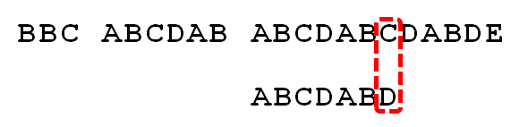
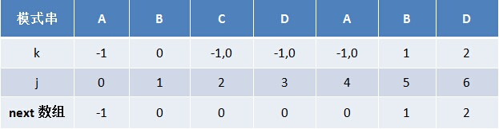

[TOC]

# LeetCode-Easy1-Top1_20

-   Problems-ID:1，7，9，13，14，20，26，27，28，35，38，53，58，66，67，69，70，83，88
-   Easy共266道题  

## [1.Two Sum](https://leetcode.com/problems/two-sum/description/)

### 题解-2018年9月27日

-   给定一组整数nums以及一个整数target,求出数组nums内一对元素之和为target的下标（有且只有一对）

#### 法一：暴力枚举

-   时间复杂度`math O(n^2)` 空间复杂度`math O(1)`
-   两重遍历，求和比较

```JAVA
class Solution {
    public int[] twoSum(int[] nums, int target) {
        for(int i = 0;i<nums.length-1;i++){
        	for(int j = i+1;j<nums.length;j++){
                if (nums[i]+nums[j]==target) {
                    int[] ans = new int[2];
                    ans[0] = i;
                    ans[1] = j;
                    return ans;
                }
            }
        }
        return  null;
    }
}
```

#### 法二：采用HashMap

-   时间复杂度`math O(n)` 空间复杂度`math O(n)`
-   采用`HaspMap<int,int>`，整数与下标做键值对

```JAVA
import java.util.HashMap;
import java.util.Map;

class Solution {
    public int[] twoSum(int[] nums, int target) {
		Map<Integer,Integer> tmap = new HashMap<>();
		for(int i = 0; i < nums.length; i++){
			int temp = target - nums[i];
			if (tmap.containsKey(temp)){//匹配成功
				return new int[]{tmap.get(temp),i};
			}//匹配失败，存入tmap候选
			tmap.put(nums[i],i);
		}
        return  null;
    }
}
```

## [7.Reverse Integer](https://leetcode.com/problems/reverse-integer/description/)

### 题解-2018年9月28日

-   给定整数x，取值范围为`math [-2^{31},2^{31}-1]`,将x反转后输出，如-120则输出-21
-   时间复杂度`math O(\lg x )` 空间复杂度`math O(1)`
-   对x逐位取模、整除，存入newx中
-   Integer的取值范围为`math [-2^{31},2^{31}-1]`,即`math [-2147483648,2147483647]`，占用4个字节,需要做溢出判断

```JAVA
class Solution {
    public int reverse(int x) {
        int newx = 0;
        while (x != 0) {
            int temp = x % 10;//取余数
            x /= 10;//整除
            //防止向上溢出2147483647
            if (newx > Integer.MAX_VALUE/10 || (newx == Integer.MAX_VALUE / 10 && temp > 7)) return 0;
            //防止向下溢出-2147483648
            if (newx < Integer.MIN_VALUE/10 || (newx == Integer.MIN_VALUE / 10 && temp < -8)) return 0;
			//逐位存入newx
            newx = newx * 10 + temp;
        }
        return newx;
    }
}
```

## [9.Palindrome Number](https://leetcode.com/problems/palindrome-number/description/)

### 题解-2018年9月28日

-   判断回文数，整数颠倒后与原来数字相同，如121为回文数，-121颠倒后121-，不为回文数
-   易得负数均不是回文数

#### 法一：将数字视作字符串处理

```Java
...
if(x<0) return false;
String res = new StringBuilder(String.valueOf(x)).reverse().toString();
return Integer.parseInt(res)==x ;
...
```

#### 法二：逐位处理,前后比较

```java
...
if(x < 0 || (x % 10 == 0 && x != 0)) {//个位数是零以及负数的情况
	return false;
}
int revertedNumber = 0;
while(x > revertedNumber) {
   revertedNumber = revertedNumber * 10 + x % 10;
   x /= 10;
}
// For example when the input is 12321, at the end of the while loop we get x = 12, revertedNumber = 123,
// since the middle digit doesn't matter in palidrome(it will always equal to itself), we can simply get rid of it.
return x == revertedNumber || x == revertedNumber/10;
...
```

## [13.Roman to Integer](https://leetcode.com/problems/roman-to-integer/description/)

### 题解-2018年9月29日

-   罗马数字转化成整数，规则如下：

        Symbol       Value
        I             1
        V             5
        X             10
        L             50
        C             100
        D             500
        M             1000
        IV			  4
        IX 			  9
        XL			  40
        XC			  90
        CD			  400
        CM			  900

-   建立映射表，观察可知， **隐含规则** 为，数字较小的字母位于前面时，需要在结果上对该数字作差，其余情况累加即可

```JAVA
public int romanToInt(String s) {
	if (s == null || s.length() == 0)
		return -1;
	//建立罗马数字映射表
	HashMap<Character, Integer> map = new HashMap<Character, Integer>();
	map.put('I', 1);
	map.put('V', 5);
	map.put('X', 10);
	map.put('L', 50);
	map.put('C', 100);
	map.put('D', 500);
	map.put('M', 1000);
	int len = s.length();
	//当较小的罗马数字位于前面（左边），则需要减去对饮数字，如IV为5-1；
	int result = map.get(s.charAt(len - 1));//初始化结果
	for (int i = len - 2; i >= 0; i--) {
		if (map.get(s.charAt(i)) >= map.get(s.charAt(i + 1)))
			result += map.get(s.charAt(i));
		else
			result -= map.get(s.charAt(i));
	}
	return result;
}
```

## [14.Longest Common Prefix](https://leetcode.com/problems/longest-common-prefix/description/)

### 题解-2018年9月30日

-   n个字符串如["flower","flow","flight"]的最长公共前缀是"fl",没有则输出空串""
-   先排序，然后直接比较第一个字符串与最后一个字符串即可，法一：若最长字符串长度为m，时间复杂度`math O(m*n\log n +m)`，字符串
-   法二，取两个字符串的公共前缀，与第三个字符串进行比较，获取三个字符串的公共前缀，以此类推，直到比较结束或者公共前缀为空，时间复杂度为`math O(mn)`

```java
class LCP {
    static String longestCommonPrefix(String[] strs) {
        if(strs == null || strs.length == 0)    return "";
        String pre = strs[0];
        int i = 1;
        while(i < strs.length && pre.length()>0 ){
            while(strs[i].indexOf(pre) != 0)
                pre = pre.substring(0,pre.length()-1);
            i++;
        }
        return pre;
    }
}
```

## [20.Valid Parentheses](https://leetcode.com/problems/valid-parentheses/description/)

### 题解-2018年10月1日

-   经典栈问题-检测括号匹配 ：'(', ')', '{', '}', '[' and ']'，将括号逐一压入栈中，遇到同类型的右括号则与栈顶的左括号成对弹出，若表达式正确，则最后栈为空

```Java
class ValidParentheses{
    //建立括号匹配列表
    private HashMap<Character,Character> ParentheseMap;
    {//初始化块
        ParentheseMap = new HashMap<Character, Character>();
        ParentheseMap.put(')','(');
        ParentheseMap.put(']','[');
        ParentheseMap.put('}','{');
    }
    boolean isValid(String s) {
        Stack<Character> aStack = new Stack<Character>();
        for(int i = 0;i<s.length();i++){
            char c = s.charAt(i);
            if(ParentheseMap.containsKey(c)){//判断是否为右括号
                if(aStack.empty()) {//右括号且栈为空，则不合法
                    return false;
                }else{
                    char topElement = aStack.pop();
                    if (topElement!=ParentheseMap.get(c)){//匹配失败
                        return false;
                    }
                }
            }else{//字符为左括号压入
                aStack.push(c);
            }
        }
        return aStack.empty();
    }
}
```

## [21.Merge Two Sorted Lists](https://leetcode.com/problems/merge-two-sorted-lists/description/)

### 题解-2018年10月2日

-   Input: 1->2->4, 1->3->4   Output: 1->1->2->3->4->4
-   题目需要链表操作

```Java
class ListNode {//题目提供
    int val;
    ListNode next;
    ListNode(int x) { val = x; }
}
class MergeTwoSortedLists{
     ListNode mergeTwoLists(ListNode l1, ListNode l2) {
        if (l1 == null) return l2;
        if (l2 == null) return l1;
        ListNode head = null;//用来存储最终结果的第一个节点
        if (l1.val <= l2.val) {//
            head = l1;
            l1 = l1.next;
        } else {
            head = l2;
            l2 = l2.next;
        }
        //移动的“光标”，引用最后一个纳入结果列表的节点
        ListNode cur = head;
        while (l1 != null && l2 != null) {
            if (l1.val <= l2.val) {
                cur.next = l1;
                l1 = l1.next;
            } else {
                cur.next = l2;
                l2 = l2.next;
            }
            cur = cur.next;
        }
        cur.next = l1 == null ? l2:l1;
        return head;
    }
}
```

## [26.Remove Duplicates from Sorted Array](https://leetcode.com/problems/remove-duplicates-from-sorted-array/description/)

### 题解-2018年10月3日

-   对有序数组进行去重并返回个数，如[0,0,1,1,1,2,2,3,3,4],去重后[0,1,2,3,4]，返回5
-   要求空间复杂度为`math O(1)`

```java
class RemoveDuplicatesfromSortedArray {
     int removeDuplicates(int[] nums) {
         int length = nums.length;
         if(length == 0)
             return 0;
         int len = 1;
         for(int i = 0;i<nums.length-1;i++){
             if (nums[i]!=nums[i+1]){
                 nums[len] = nums[i+1];
                 len++;
             }
         }
         return len;
    }
}
```

## [27.Remove Element](https://leetcode.com/problems/remove-element/description/)

### 题解-2018年10月4日

-   给定一个整型数组nums与一个整数val，将nums数组内的val删除后返回数组长度以及数组
-   要求空间复杂度为`math O(1)`

```Java
class RemoveElement {
    int removeElement(int[] nums, int val) {
        int length = nums.length;
        if(length == 0)
            return 0;
        int index = 0;
        for(int i = 0;i<nums.length;i++){
            if (nums[i]!=val){//保留不是val的值在数组前面
                nums[index] = nums[i];
                index++;
            }
        }
        return index;
    }
}
```

## [28.Implement strStr()](https://leetcode.com/problems/implement-strstr/description/)

### 题解-2018年10月5日

-   返回第一次出现的子串的位置，如 "hello"与"ll"则返回2，否则返回-1，如果子串为空则返回0

#### 法一：暴力枚举

-   时间复杂度`math O(n^2)`

```Java
class ImplementstrStr {
    int strStr(String haystack, String needle) {
        for (int i = 0; ; i++) {//枚举haystack匹配的第一个位置
            for (int j = 0; ; j++) {//枚举已经匹配的子串字符个数
                if (j == needle.length()) return i;//子串字符完全匹配，返回匹配起始位置i
                if (i + j == haystack.length()) return -1;//未匹配结束但haystack已到结尾
                if (needle.charAt(j) != haystack.charAt(i + j)) break;//匹配错误，枚举下一个位置
            }
        }
    }
}
```

#### 法二：KMP算法

-   问题复述：有一个文本串S，和一个模式串P，现在要查找P在S中的位置，怎么查找呢？
-   [参考博文：从头到尾彻底理解KMP（2014年8月22日版）](https://blog.csdn.net/v_july_v/article/details/7041827)
-   计算流程如下：

    1.  计算模式串的前缀与后缀的最大公共长度- **next数组**`math O(m)`
        
        

    2.  遍历文本串进行逐一匹配，失配时， **模式串向右移动的位数为：已匹配字符数 - 失配字符的上一位字符所对应的最大长度值** `math O(n)`
        
        
        
        如此处失配，则向右移动6-2(next[6]) = 4位，如下
        
        
        
        

-   时间复杂度`math O(n+m)`

```Java
class ImplementstrStr {
	int strStrKMP(String s, String p) {
		//KMP algorithms
		if(s.equals("")) return 0;
		if(p.equals("")) return 0;
		int sLen = s.length();
		int pLen = p.length();
		char[] S =s.toCharArray();
		char[] P = p.toCharArray();
		int[] next = makeNext(P);
		//开始KMP匹配
		while(i<sLen&&j<pLen){
			//如果j=-1，或者当前字母匹配成功，那么比较下一个
			if (j==-1||S[i]==P[J]) {
				i++;
				j++;
			}else//②如果j != -1，且当前字符匹配失败（即S[i] != P[j]），则令 i 不变，j = next[j]  
			 	//即，回退到最长公共前后缀的下一个字符去匹配
				j = next[j];

		}
		if(j==pLen)//P串匹配完了
			return i-j;//返回匹配成功的起始下标
		else
			return -1;
	}

	private int[] makeNext(char[] p){
		int len = p.length;
		int[] next = new int[len];//记录除去当前字符之前子串的最长公共前后缀
		next[0] = -1;
		int k = -1;
		int j = 0;
		while(j<len-1){
			//p[k]表示前缀，p[j]表示后缀
			if (k==-1||p[j]==p[k]) {//匹配上了
				next[j+1]=k+1;
				k++;
				j++;
			}else//匹配失败，回去找更小的公共前缀
				k=next[k];
		}
		return next;
	}
}
```

-   用计算下“ABCDABD”的next 数组
    

## [35.Search Insert Position](https://leetcode.com/problems/search-insert-position/description/)

### 题解-2018年10月6日

-   有序数组nums以及一个整数，返回这个整数在数组的位置，或者应该插入到哪一个位置
-   两种方法：枚举`math O(n)`；二分查找`math O(lgn)`

```Java
//枚举
class SearchInsertPosition {
    int searchInsert(int[] nums, int target) {
        int i =0;
        while(i < nums.length && nums[i]<target ){
            i++;
        }
        return  i;
    }
}
```

## [38.Count and Say](https://leetcode.com/problems/count-and-say/description/)

### 题解-2018年10月7日

-   找规律

```code
1.     1
2.     11
3.     21
4.     1211
5.     111221
6.     312211
7.     13112221
8.     1113213211
9.     31131211131221
10.     13211311123113112211
```

-   Given an integer n where 1 ≤ n ≤ 30,找出第n个字符串

```Java
class CountAndSay {
    public String countAndSay(int n) {
        StringBuilder curr=new StringBuilder("1");
        StringBuilder prev;
        int count;
        char say;
        for (int i=1;i<n;i++){
            prev=curr;
            curr=new StringBuilder();
            count=1;
            say=prev.charAt(0);
            for (int j=1,len=prev.length();j<len;j++){
                if (prev.charAt(j)!=say){
                    curr.append(count).append(say);
                    count=1;
                    say=prev.charAt(j);
                }
                else count++;
            }
            curr.append(count).append(say);
        }
        return curr.toString();

    }
}
```

## [53.Maximum Subarray](https://leetcode.com/problems/maximum-subarray/description/)

### 题解-2018年10月8日

-   给定整数数组nums，计算最大子段和
-   [最大子段和详解（N种解法汇总）](https://blog.csdn.net/zhong36060123/article/details/4381391)
-   动态规划`math O(n)`解法如下
    -   用SumWithI[i]记录包含第i个元素的最长连续子段和,则由状态转移方程`SumWithI[i]=max{nums[i],SumWithI[i-1]+nums[i]}`
    -   SumWithI的最大值即为结果

```Java
class MaximumSubarray {
    public int maxSubArray(int[] nums) {
        if (nums.length==0)
            return 0;
        int[] SumWithI = new  int[nums.length];
        SumWithI[0] = nums[0];
        for(int i = 1;i<nums.length;i++){
            SumWithI[i] = (SumWithI[i-1]+nums[i])>nums[i]?SumWithI[i-1]+nums[i]:nums[i];
        }
        int maxsum  = SumWithI[0];
        for (int i = 0;i<nums.length;i++){
            maxsum = maxsum  > SumWithI[i]?maxsum:SumWithI[i];
        }
        return maxsum;
    }
}
```

## [58.Length of Last Word](https://leetcode.com/problems/length-of-last-word/description/)

### 题解-2018年10月9日

-   字符串处理：找出字符串中最后一个单词的长度

```Java
class LengthofLastWord {
    public int lengthOfLastWord(String s) {
        int count = 0;
        for(int i=s.length()-1; i>=0; i--) {//从字符串尾巴找起
            if(s.charAt(i) != ' ') {//定位到了最后一个单词
                while(i > -1 && s.charAt(i) != ' ') {//统计单词长度
                    count++;
                    i--;
                }
                break;//退出
            }
        }
        return count;
    }
}
```

## [66.Plus One](https://leetcode.com/problems/plus-one/description/)

### 题解-2018年10月10日

-   高精度加法：但只在个位加1

```Java
class PlusOne {
    public int[] plusOne(int[] digits) {
        if(digits.length==0) {
            return new int[]{1};
        }
        int i = digits.length - 1;
        digits[i] = digits[i]+1;
        while(i>0&&  digits[i]> 9 ){
            digits[i] = 0;
            i--;
            digits[i] = digits[i]+1;//进位
        }
        if (digits[0]<=9){
            return digits;
        }else{//最高位需要进位
            int[] newdigits = new int[digits.length+1];
            newdigits[0] = 1;
            newdigits[1] = 0;
            for ( i = 1;i<digits.length;i++){
                newdigits[i+1] = digits[i];
            }
            return newdigits;
        }
    }
}
```

## [67.Add Binary](https://leetcode.com/problems/add-binary/description/)

### 题解-2018年10月11日

-   字符串a、b两个01串，做二进制加法， 返回结果字符串

```Java
public String addBinary(String a, String b) {
	StringBuilder ans = new StringBuilder();//低位在前高位在后
	int i = a.length()-1;
	int j = b.length()-1;
	int carry = 0;//记录进位
	while(i>=0||j>=0){
		//相加
		int sum = carry;
		if(j>=0){
			sum = sum + b.charAt(j)-'0';
			j--;
		}
		if(i>=0){
			sum = sum + a.charAt(i)-'0';
			i--;
		}
		ans.append(sum%2);
		carry = sum/2;
	}
	if (carry != 0) ans.append(carry);
	return ans.reverse().toString(); //反转过来并更换数据类型
}
```

## [69.Sqrt(x)](https://leetcode.com/problems/sqrtx/description/<>)

### 题解-2018年10月12日

-   实现sqrt(x)函数，结果返回整数，采用截断法
-   二分查找答案的方法，问题转换为找出最大的整数num，使得`math num\leq \frac{x}{num}`

```Java
class MySqrt {
    public int mySqrt(int x) {
        if (x <= 1) return x;
        int lo = 1, hi = x;//答案的取值范围
        while (lo < hi) {
            int mid = (lo +hi) / 2+1;
            if (mid <= x/mid) {
                lo = mid;
            } else {
                hi = mid - 1;
            }
        }
        return lo;//最终到达一个临界点
    }
}
```

## [⭐70.Climbing Stairs](https://leetcode.com/problems/climbing-stairs/description/)

### 题解-2018年10月13日

-   走楼梯，每次能跨一步或者两步，求上n阶楼梯的方法数
-   [详细解法](https://leetcode.com/problems/climbing-stairs/solution/)，Approach 5: Binets Method 时间复杂度为`math O(\log n)`

#### 法一：动态规划

-   时间复杂度`math O(n)`，空间复杂度`math O(n)`也可以为`math O(1)`
-   用DP[i]记录到达第i层台阶的方法数，则有状态转移方程为`DP[i]=DP[i-1]+DP[i-2]}`

```Java
class ClimbStairs {
    public int climbStairs(int n) {
        if (n == 1) {
            return 1;
        }
        int[] dp = new int[n + 1];
        dp[1] = 1;
        dp[2] = 2;
        for (int i = 3; i <= n; i++) {
            dp[i] = dp[i - 1] + dp[i - 2];
        }
        return dp[n];
    }
}
```

## [83.Remove Duplicates from Sorted List](https://leetcode.com/problems/remove-duplicates-from-sorted-list/description/)

### 题解-2018年10月14日

-   链表操作：Input: 1->1->2->3->3  Output: 1->2->3

```Java
class RemoveDuplicatesfromSortedList {
    ListNode deleteDuplicates(ListNode head) {
        if(head == null|| head.next == null) return head;
        ListNode listIndex = head;
        while(listIndex.next != null) {
            if (listIndex.val == listIndex.next.val) {//与下一个相同，跳过
                listIndex.next = listIndex.next.next;
            } else {
                listIndex = listIndex.next;
            }
        }
        return head;
    }
}
```

## [88.Merge Sorted Array](https://leetcode.com/problems/merge-sorted-array/description/)

### 题解-2018年10月15日

-   merge nums2 into nums1 as one sorted array
-   Input: nums1 = [1,2,3,0,0,0],m = 3;  nums2 = [2,5,6],n = 3 ; Output: [1,2,2,3,5,6]

```Java
class MergeSortedArray {
    public void merge(int A[], int m, int B[], int n) {
        int i = m - 1, j = n - 1, k = m + n - 1;
        while(i >= 0 && j >= 0) {
            A[k--] = A[i] > B[j] ? A[i--] : B[j--];
        }
        while(j >= 0) {
            A[k--] = B[j--];
        }
    }
}
```
