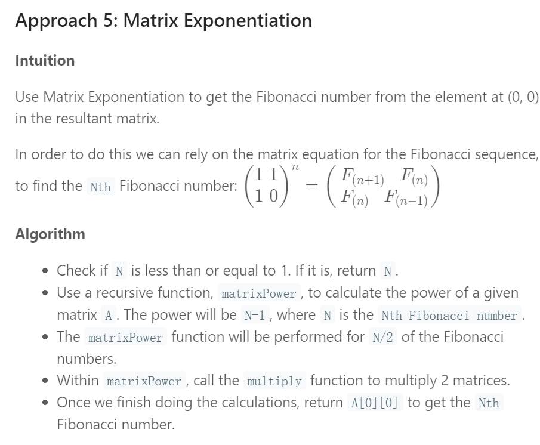

[TOC]

# LeetCode-Easy7-Top121_140

-   Problems-ID：448、453、455、459、461、463、475、476、482、485、492、496、500、501、504、506、507、509、 **511** 、 **512**

## [448. Find All Numbers Disappeared in an Array](https://leetcode.com/problems/find-all-numbers-disappeared-in-an-array/)

### ⭐题解（数组与下标）-2019年12月17日

-   标记并找出数组中没出现的数字： **利用下标标记**

```java
public class P448_FindAllNumbersDisappearedinanArray {
    public List<Integer> findDisappearedNumbers(int[] nums) {
        List<Integer> ans = new ArrayList<>();
        for (int i = 0; i < nums.length; i++) {
            int val = Math.abs(nums[i])-1;
            if (nums[val] > 0) {
                nums[val] = -nums[val];
            }
        }

        for (int i = 0; i < nums.length; i++) {
            if (nums[i] > 0) {
                ans.add(i + 1);
            }
        }
        return ans;
    }
    public static void main(String[] args) {
        Scanner in = new Scanner(System.in);
        int n = in.nextInt();
        int[] nums = new int[n];
        for (int i = 0;i<n;i++) {
            nums[i] = in.nextInt();
        }
        System.out.println(new P448_FindAllNumbersDisappearedinanArray().findDisappearedNumbers(nums));
    }
}
```

## [453. Minimum Moves to Equal Array Elements](https://leetcode.com/problems/minimum-moves-to-equal-array-elements/)

### 题解（数学题）-2019年12月18日

```java
public class P453_MinimumMovestoEqualArrayElements {
    public int minMoves(int[] nums) {
        int min = nums[0];
        int sum = 0;
        for (int val : nums) {
            min = Math.min(min, val);
            sum += val;
        }
        return sum - nums.length * min;
    }

    public static void main(String[] args) {
        int[] nums = {1, 2, 3};
        System.out.println(new P453_MinimumMovestoEqualArrayElements().minMoves(nums));
    }
}
```

## [455. Assign Cookies](https://leetcode.com/problems/assign-cookies/)

### 题解（贪心算法）-2019年12月19日

```java
public class P455_AssignCookies {
    public int findContentChildren(int[] g, int[] s) {
        Arrays.sort(g);
        Arrays.sort(s);
        int ans = 0;
        int i = 0, j = 0;
        while (i < g.length && j < s.length) {
            if (g[i] <= s[j]) {
                ans++;
                i++;
                j++;
            }else{
                j++;
            }
        }
        return ans;
    }

    public static void main(String[] args) {
        int[] a = {1, 2, 3};
        int[] b = {1, 1};
        System.out.println(new P455_AssignCookies().findContentChildren(a, b));
    }
}
```

## [459. Repeated Substring Pattern](https://leetcode.com/problems/repeated-substring-pattern/)

### ⭐题解（循环字符字串）-2019年12月20日

```java
public class P459_RepeatedSubstringPattern {
    public boolean repeatedSubstringPattern(String s) {
        String s1 = s + s;
        String s2 = s1.substring(1, s1.length() - 1);
        return s2.contains(s);
    }

    public static void main(String[] args) {
        System.out.println(new P459_RepeatedSubstringPattern().repeatedSubstringPattern("abab"));
    }
}
```

## [461. Hamming Distance](https://leetcode.com/problems/hamming-distance/)

### 题解（位运算）-2019年12月21日

```java
public class P461_HammingDistance {
    public int hammingDistance(int x, int y) {
        int xor = x^y;
        return Integer.bitCount(xor);
    }
    public static void main(String[] args) {
        System.out.println(new P461_HammingDistance().hammingDistance(1,4));
    }
}
```

## [463. Island Perimeter](https://leetcode.com/problems/island-perimeter/)

### 题解（二维数组）-2019年12月22日

```java
public class P463_IslandPerimeter {
    public int islandPerimeter(int[][] grid) {
        int count = 0;
        for (int i = 0; i < grid.length; i++) {
            for (int j = 0; j < grid[i].length; j++) {
                if (grid[i][j]==0) continue;
                if (i == 0) {
                    count++;
                } else if (grid[i-1][j] == 0){
                    count++;
                }
                if (j == 0) {
                    count++;
                }else if (grid[i][j - 1] == 0)
                    count++;
                if (i==grid.length-1) {
                    count++;
                }else if(grid[i+1][j]==0)
                    count++;
                if (j==grid[i].length-1) count++;
                else if (grid[i][j + 1] == 0) count++;
            }
        }
        return count;
    }
    public static void main(String[] args) {
        int[][] grid={
                {0,1,0,0 },
                {1,1,1,0 },
                {0,1,0,0 },
                {1,1,0,0 },
        };
        System.out.println(new P463_IslandPerimeter().islandPerimeter(grid));
    }
}
```

## [475. Heaters](https://leetcode.com/problems/heaters/)

### 题解（线段题）-2019年12月23日

-   向上取整用Math.ceil(double a)
-   向下取整用Math.floor(double a)

```java
public class P475_Heaters {
    public int findRadius(int[] houses, int[] heaters) {
        Arrays.sort(houses);
        Arrays.sort(heaters);
        int i = 0, j = 0, res = 0;
        while (i < houses.length) {
            while (j < heaters.length - 1
                    && Math.abs(heaters[j + 1] - houses[i]) <= Math.abs(heaters[j] - houses[i])) {
                j++;
            }
            res = Math.max(res, Math.abs(heaters[j] - houses[i]));
            i++;
        }
        return res;
    }
    public static void main(String[] args) {
        System.out.println(new P475_Heaters().findRadius(new int[]{1,2,3,4,5},new int[]{1,5}));
    }
}
```

## [476. Number Complement](https://leetcode.com/problems/number-complement/)

### ⭐题解（位运算）-2019年12月24日

-   Integer.highestOneBit(num)：二进制位数
-   掩码：`(Integer.highestOneBit(num)<<1)-1`

```java
public class P476_NumberComplement {
    public int findComplement(int num) {
        //与掩码做异或运算
        return num^((Integer.highestOneBit(num)<<1) - 1);
    }
    public static void main(String[] args) {
        System.out.println(new P476_NumberComplement().findComplement(1));
    }
}
```

## [482. License Key Formatting](https://leetcode.com/problems/license-key-formatting/)

### ⭐题解（字符串）-2019年12月25日

1.  StringBuilder是可变对象，用来高效拼接字符串；
2.  StringBuilder可以支持链式操作，实现链式操作的关键是返回实例本身；
3.  StringBuffer是StringBuilder的线程安全版本，现在很少使用。

-   S = "2-5g-3-J", K = 2 → "2-5G-3J"
-   S = "5F3Z-2e-9-w", K = 4 → "5F3Z-2E9W"

```java
public class P482_LicenseKeyFormatting {
    public String licenseKeyFormatting(String S, int K) {
        StringBuilder sb = new StringBuilder();
        for (int i = S.length() - 1; i >= 0; i--) {
            if (S.charAt(i) != '-') {
                sb.append(sb.length()%(K+1)==K?'-':"");
                sb.append(S.charAt(i));
            }
        }
        return sb.reverse().toString().toUpperCase();
    }
    public static void main(String[] args) {
        System.out.println(new P482_LicenseKeyFormatting().licenseKeyFormatting("5F3Z-2e-9-w",4));
    }
}
```

## [485. Max Consecutive Ones](https://leetcode.com/problems/max-consecutive-ones/)

### 题解-2019年12月26日

```java
public class P485_MaxConsecutiveOnes {
    public int findMaxConsecutiveOnes(int[] nums) {
        int ans = 0,temp = 0;
        for (int val:nums) {
            if (val == 0) {
                ans = Math.max(ans, temp);
                temp=0;
            }else
                temp++;
        }
		ans = Math.max(ans, temp);
        return ans;
    }
    public static void main(String[] args) {
        System.out.println(new P485_MaxConsecutiveOnes().findMaxConsecutiveOnes(new int[]{1,1,1,0,1,1}));
    }
}
```

## [492. Construct the Rectangle](https://leetcode.com/problems/construct-the-rectangle/)

### 题解（数学-开方）-2019年12月27日

```java
public class P492_ConstructtheRectangle {
    public int[] constructRectangle(int area) {
        int w = (int)Math.sqrt(area);
        while (area%w!=0) w--;
        return new int[]{area/w, w};
    }

    public static void main(String[] args) {
        System.out.println(new P492_ConstructtheRectangle().constructRectangle(4));

    }
}
```

## [496. Next Greater Element I](https://leetcode.com/problems/next-greater-element-i/)

### ⭐题解（栈&HashMap）-2019年12月28日

-   `ans[i] = map.getOrDefault(nums1[i], -1);`

```java
public class P496_NextGreaterElementI {
    public int[] nextGreaterElement(int[] nums1, int[] nums2) {
        Map<Integer, Integer> map = new HashMap<>();
        //构造x与后续比x大的映射
        Stack<Integer> stack = new Stack<>();
        for (int num : nums2) {
            while (!stack.empty() && stack.peek() < num) {
                map.put(stack.pop(), num);
            }
            stack.push(num);
        }
        //查询
        int[] ans = new int[nums1.length];
        for (int i = 0;i<nums1.length;i++) {
            //当Map集合中有这个key时，就使用这个key的值，如果没有就使用默认值defaultValue
            ans[i] = map.getOrDefault(nums1[i], -1);
        }
        return ans;
    }
    public static void main(String[] args) {
        int[] num1= {9,8,4,6,7,2,3,10};
        int[] num2 ={9,8,4,6,7,2,3,10};
        System.out.println(Arrays.toString(new P496_NextGreaterElementI().nextGreaterElement(num1,num2)));
    }
}
```

## [500. Keyboard Row](https://leetcode.com/problems/keyboard-row/)

### ⭐题解（LinkedList、Map）-2019年12月29日

-   **链表转数组知识点**:`keywords.toArray(new String[0]);`

```java
public class P500_KeyboardRow {
    public String[] findWords(String[] words) {
        String[] keyboardrow = {"qwertyuioop","asdfghjkl","zxcvbnm"};
        Map<Character, Integer> map = new HashMap<>();
        for(int i = 0; i<keyboardrow.length; i++){
            for(char c: keyboardrow[i].toCharArray()){
                map.put(c, i);//put <char, rowIndex> pair into the map
            }
        }
        List<String> keywords = new LinkedList<>();
        for (String w : words) {
            if (w.equals("")) continue;
            int index = map.get(w.toLowerCase().charAt(0));
            for (char c : w.toLowerCase().toCharArray()) {
                if (map.get(c) != index) {
                    index = -1;
                    break;
                }
            }
            if (index != -1) {
                keywords.add(w);
            }
        }
        //错误！！
        //return (String[]) keywords.toArray();
        return keywords.toArray(new String[0]);
    }
    public static void main(String[] args) {
        System.out.println(
                Arrays.toString(
                        new P500_KeyboardRow().findWords( new String[]{"Hello", "Alaska", "Dad", "Peace"})
                )
        );
    }
}
```

## [501. Find Mode in Binary Search Tree](https://leetcode.com/problems/find-mode-in-binary-search-tree/)

### ⭐题解（二叉树遍历）-2019年12月30日

-   找出二叉树中出现最多次的元素
-   ArrayList如何转换为`int[]`数组

```java
int[] d = new int[list.size()];
for(int i = 0;i<list.size();i++){
    d[i] = list.get(i);
}
```

```java
public int[] findMode(TreeNode root) {
	if (root==null) {
		return new int[]{};
	}
    Map<Integer, Integer> map = new HashMap<>();
    Queue<TreeNode> nodeQueue = new LinkedList<>();
    int max=0;
    nodeQueue.add(root);
    while (!nodeQueue.isEmpty()) {
        TreeNode node = nodeQueue.remove();
        if (node.left != null) {
            nodeQueue.add(node.left);
        }
        if (node.right != null) {
            nodeQueue.add(node.right);
        }

        map.put(node.val, map.getOrDefault(node.val, 0) + 1);
        max = Math.max(max, map.get(node.val));
    }

    List<Integer> mode = new ArrayList<>();
    for (int key : map.keySet()) {
        if (map.get(key) == max) {
            mode.add(key);
        }
    }

    int[] res = new int[mode.size()];
    for (int i = 0; i < mode.size(); i++) {
        res[i] = mode.get(i);
    }
    return res;
}
```

## [504. Base 7](https://leetcode.com/problems/base-7/)

### 题解（字符串-进制转换）-2019年12月31日

```java
public class P504_Base7 {
    public String convertTo7(int num) {
        if (num == 0) {
            return "0";
        }
        StringBuilder sb = new StringBuilder();
        boolean negative = false;
        if (num < 0) {
            negative = true;
        }
        while (num != 0) {
            sb.append(Math.abs(num % 7));
            num = num / 7;
        }
        if (negative) {
            sb.append("-");
        }
        return sb.reverse().toString();
    }
    public static void main(String[] args) {
        System.out.println(new P504_Base7().convertTo7(100));
    }
}
```

## [506. Relative Ranks](https://leetcode.com/problems/relative-ranks/)

### ⭐题解（关键字排序）-2020年1月1日

-   数组：nums:10，3，8，9，4与rank：1，2，3，4，5
-   按nums的大到小排rank的序：`Arrays.sort(index,(a,b)->(nums[b]-nums[a]));`

```java
public class P506_RelativeRanks {
    public String[] findRelativeRanks(int[] nums) {
        //选手编号
        Integer[] rank = new Integer[nums.length];
        for (int i = 0; i < rank.length; i++) {
            rank[i] = i;
        }
        //按成绩从大到小排名次，并将选手编号按名次放进index数组中，即第i+1名的选手编号为rank[i]
        Arrays.sort(rank,(a,b)->(nums[b]-nums[a]));
        //System.out.println(Arrays.toString(rank));
        String[] res = new String[nums.length];
        for (int i = 0; i < nums.length; i++) {
            if (i == 0) {
                res[rank[i]] = "Gold Medal";
            }else if (i == 1) {
                res[rank[i]] = "Silver Medal";
            }else if (i == 2) {
                res[rank[i]] = "Bronze Medal";
            }else{
                res[rank[i]] = (i + 1) + "";
            }
        }
        return res;
    }
    public static void main(String[] args) {
        System.out.println(Arrays.toString(
                new P506_RelativeRanks().findRelativeRanks(new int[]{10,3,8,9,4})
        ));
    }
}
```

## [507. Perfect Number](https://leetcode.com/problems/perfect-number/)

### 题解（数学+枚举）-2020年1月2日

```java
public class P507_PerfectNumber {
    public boolean checkPerfectNumber(int num) {
        if (num == 1) {
            return false;
        }
        int sum = 0;
        for (int i = 2; i <= Math.sqrt(num); i++) {
            if (num % i == 0) {
                sum += i + num / i;
            }
        }
        sum++;
        return sum == num;
    }
    public static void main(String[] args) {
        System.out.println(new P507_PerfectNumber().checkPerfectNumber(28));
    }
}
```

## [509. Fibonacci Number](https://leetcode.com/problems/fibonacci-number/)

### 题解（斐波那契数列）-2020年1月3日

-   直接递归会重复运算，时间复杂度时指数级的
-   记忆化递归时间复杂度为线性的

```java
public class P509_FibonacciNumber {
    List<Integer> cache = new ArrayList<>();
    {
        cache.add(0);
        cache.add(1);
    }
    public int fib(int N) {
        if (N <= 1) {
            return cache.get(N);
        }
        if (N < cache.size()) {
            return cache.get(N);
        } else {
            int temp = fib(N-1) + fib(N - 2);
            cache.add(temp);
            return cache.get(N);
        }
    }

    public static void main(String[] args) {
        System.out.println(new P509_FibonacciNumber().fib(4));
    }
}
```

-   矩阵运算，`math O(logN)`
    

```java
class Solution {
    int fib(int N) {
        if (N <= 1) {
          return N;
        }
        int[][] A = new int[][]{{1, 1}, {1, 0}};
        matrixPower(A, N-1);

        return A[0][0];
    }

    void matrixPower(int[][] A, int N) {
        if (N <= 1) {
          return;
        }
        matrixPower(A, N/2);
        multiply(A, A);

        int[][] B = new int[][]{{1, 1}, {1, 0}};
        if (N%2 != 0) {
            multiply(A, B);
        }
    }

    void multiply(int[][] A, int[][] B) {
        int x = A[0][0] * B[0][0] + A[0][1] * B[1][0];
        int y = A[0][0] * B[0][1] + A[0][1] * B[1][1];
        int z = A[1][0] * B[0][0] + A[1][1] * B[1][0];
        int w = A[1][0] * B[0][1] + A[1][1] * B[1][1];

        A[0][0] = x;
        A[0][1] = y;
        A[1][0] = z;
        A[1][1] = w;
    }
}
```

## [LOCKED UP]511. Game Play Analysis I

## [LOCKED UP]512. Game Play Analysis II
